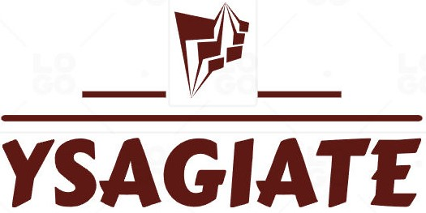
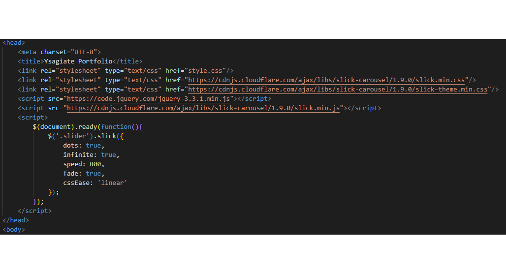

<!-- PROJECT LOGO -->
 

  

  <h3 align="center">Mangaka Artist Blog</h3>

  

    A blog website designed specificly for an artist 
     
    this website is designed so a mangaka can show his or her work to world.
    
     
     

  

<!-- TABLE OF CONTENTS -->

## Table of Contents

  <ol>
    <li>
      <a href="#about-the-project">About The Project</a>
    </li>
    <li>
      <a href="#Naming">Naming</a>
    </li>
    <li>
      <a href="#Table Representation">Table Representation</a>
    </li>
    <li><a href="#license">License</a></li>
    <li><a href="#contact">Contact</a></li>
    <li><a href="#acknowledgments">Acknowledgments</a></li>
  </ol>

 
 
 

<!-- ABOUT THE PROJECT -->
## About The Project

![Product Name Screen Shot][product-screenshot]

 
 
 
 
 
This is a blog template for a academic project based on a mangaka artist.

** The idea behind this project was to build a personal blog as a mangaka artist. 
  We named our mangaka Ysagiate and created a simple logo.  
  We wanted to add some photos as a presentation of our mangaka work.In order of not consuming a large space of our web page with the photos,
  we thought to insert a Javascript function as a slider. 
  

 
 
 
 

<!-- LICENSE -->
## License

Distributed under the GPL License. See `LICENSE.txt` for more information.

(<a href="#readme-top">back to top</a>)

<!-- CONTACT -->
## Contact

Giannis Kekes - micron00@mail.com
Project Link: - [https://github.com/Jozmon/manga-blog][repo-link]

(<a href="#readme-top">back to top</a>)

<!-- ACKNOWLEDGMENTS -->
## Acknowledgments

* [Giannis Kekes](micron00@mail.com)
* [Leonidas](https://github.com/InkiStark)
* [Theodosis Tsiavos](theotsiavos92@gmail.com)
* [Alexandra](unknown@example.com)

(<a href="#readme-top">back to top</a>)

<!-- MARKDOWN LINKS & IMAGES -->
[product-screenshot]: images/screenshot.png
[repo-link]: https://github.com/Jozmon/shitbox
