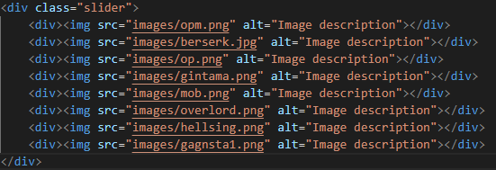
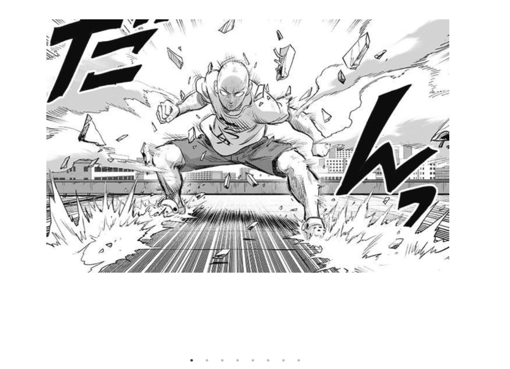
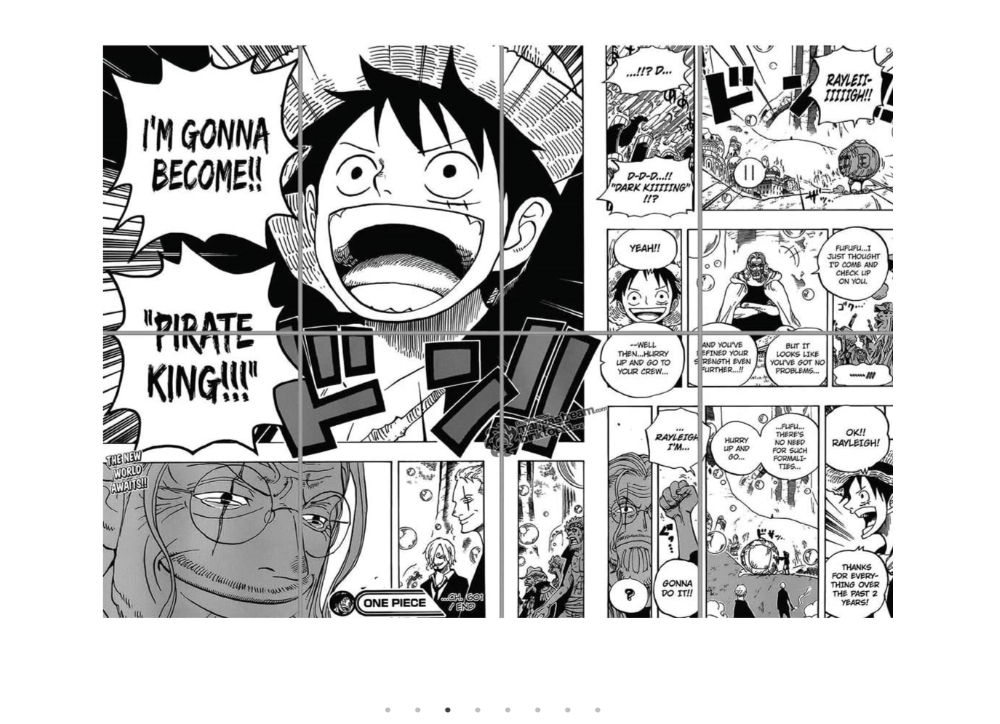
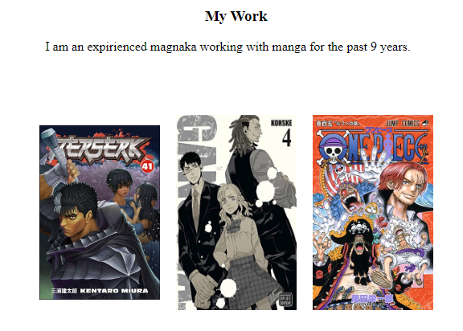
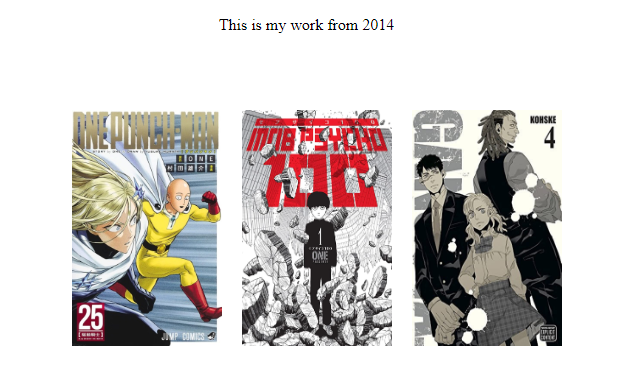
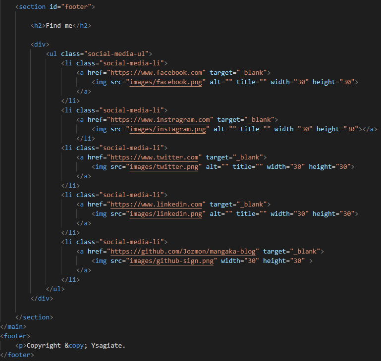
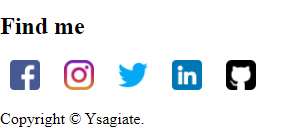
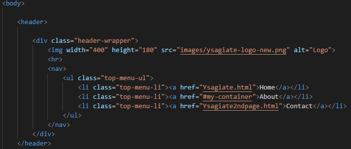
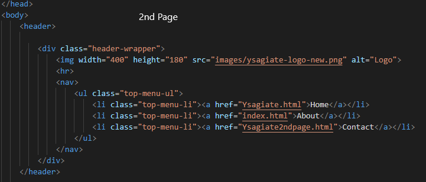

<!-- PROJECT LOGO -->
 

  

  <h3 align="center">Mangaka Artist Blog</h3>

  

    A blog website designed specificly for an artist 
     
    this website is designed so a mangaka can show his or her work to world.
    
     
     

  

<!-- TABLE OF CONTENTS -->

## Table of Contents

  <ol>
  <li><a href="#about-the-project">About The Project</a></li>
    <li><a href="#license">License</a></li>
    <li><a href="#contact">Contact</a></li>
    <li><a href="#acknowledgments">Acknowledgments</a></li>
  </ol>

 
 
 

<!-- ABOUT THE PROJECT -->
## About The Project

![Product Name Screen Shot][product-screenshot]

 
 
 
 
 

This is an academic project made by our team as part of our course in Web Design .The aim of the project is to create a blog depicting the works of a manga artist , while at the same time being simple and clear, offering basic functionalities like a contact form and information about the artist's work
 
 
 
 

+ The idea behind this project was to build a personal blog as a mangaka artist. 
 The first page would include a Logo, main menu and social media, on the second one it would have a contact section form.
 We named our mangaka Ysagiate and created a simple logo.  
 We wanted to add some photos as a presentation of our mangaka work.In order of not consuming a large space of our web page with the photos,
 we thought to insert a Javascript function as a slider. 
   
   
   
  The above function gave us the results shown bellow from the screenshots 
  
    
   
  On the third section of the first page we wanted to add 2 paragraphs with few images next to each one for our mangaka. 
  On those 2 paragraphs the artist can tell viwers about his work and show them through images. 
      
      
     
  Closing up the first page we added the social media reach buttons as shown bellow. 
    
     
     
    In order to use the second page through the first one, we changed the .html on the menu to correspond 
    to the according section, so the **Memu** would simply go to the menu, the **About** would move to my work and the **Contact** 
    button would move to the 2nd page. The same thing occurs on the second page. 
    This can be illustrated by the bellow screenshots: 
    
     
     On the contact page we added a contact form so that a guest may send an email and add a comment as well: 
     
     
    
    
    

    

    
   

 
 
 
 

<!-- LICENSE -->
## License

Distributed under the GPL License. See `LICENSE.txt` for more information.

(<a href="#readme-top">back to top</a>)

<!-- CONTACT -->
## Contact

Giannis Kekes - micron00@mail.com 
Project Link: - [https://github.com/Jozmon/manga-blog][repo-link]

(<a href="#readme-top">back to top</a>)

<!-- ACKNOWLEDGMENTS -->
## Acknowledgments

* [Giannis Kekes](micron00@mail.com)
* [Leonidas](https://github.com/InkiStark)
* [Theodosis Tsiavos](theotsiavos92@gmail.com)
* [Alexandra](unknown@example.com)

(<a href="#readme-top">back to top</a>)

<!-- MARKDOWN LINKS & IMAGES -->
[product-screenshot]: images/screenshot.png
[repo-link]: https://github.com/Jozmon/shitbox
